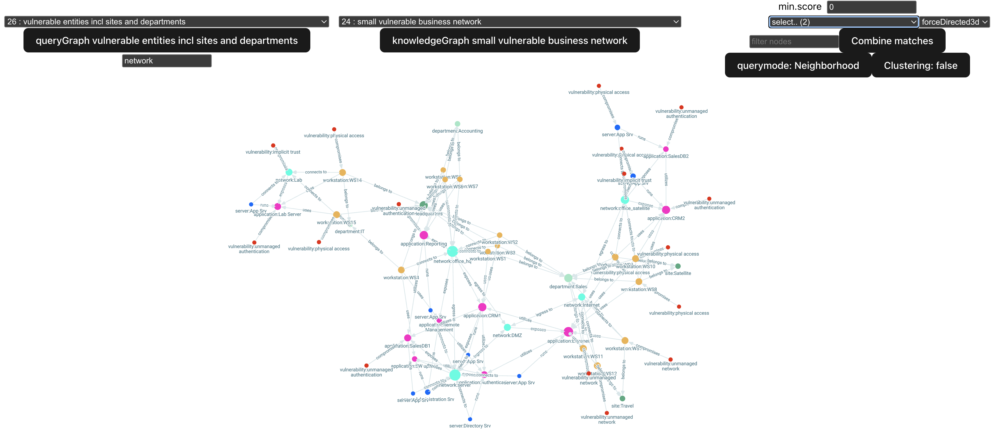

# Re-implemented PINGS for a Master's thesis case

The algorithms
**Procedures for INvestigative Graph Search**, by Muramudalige et al
was re-implented for studying the purpose of using the principles 
of the algorithm in another problem domain. 

The re-implentation followed the algorithm descriptions provided in 
the original articles, with some modifications and assumptions 
serving the intended use case of the Master's thesis.

The original articles cited and inspired this work are:

```bibtex
@article{Muramudalige2021,
abstract = {Tracking individuals or groups based on their hidden and/or emergent behaviors is an indispensable task in homeland security, mental health evaluation, and consumer analytics. On-line and off-line communication patterns, behavior profiles and social relationships form complex dynamic evolving knowledge graphs. Investigative search involves capturing and mining such large-scale knowledge graphs for emergent profiles of interest. While graph databases facilitate efficient and scalable operations on complex heterogeneous graphs, dealing with incomplete, missing and/or inconsistent information and need for adaptive querying pose major challenges. We address these by proposing an inexact graph pattern matching method, which is implemented in a graph database with a scoring mechanism that helps identify hidden behavioral patterns. PINGS ( P rocedures for IN vestigative G raph S earch), a graph database library of procedures for investigative graph search is presented. Results presented demonstrate the capability of detecting individuals/groups meeting query criteria as well as the iterative query performance in graph databases. We evaluate our approach on three datasets: a synthetically generated radicalization dataset, a publicly available patient's ICU hospitalization stays dataset, and a crime dataset. These varied datasets demonstrate the wide-range applicability and the enhanced effectiveness of observing suspicious or latent trends in investigative domains.},
author = {Muramudalige, Shashika R and Hung, Benjamin W. K and Jayasumana, Anura P and Ray, Indrakshi and Klausen, Jytte},
copyright = {Copyright 2021 Elsevier B.V., All rights reserved.},
issn = {1939-1374},
journal = {IEEE transactions on services computing},
keywords = {Data mining ; Databases ; graph databases ; graph pattern matching ; inexact matching ; investigative graph search ; Libraries ; Pattern matching ; Social networking (online) ; social networks ; Task analysis ; Terrorism},
language = {eng},
pages = {1-1},
publisher = {IEEE},
title = {Enhancing investigative pattern detection via inexact matching and graph databases},
year = {2021}
}

@inproceedings{Muramudalige2019,
abstract = {Identification and tracking of individuals or groups perpetrating latent or emergent behaviors are significant in home-land security, cyber security, behavioral health, and consumer analytics. Graphs provide an effective formal mechanism to capture the relationships among individuals of interest as well as their behavior patterns. Graph databases, developed recently, serve as convenient data stores for such complex graphs and allow efficient retrievals via high-level libraries and the ability to implement custom queries. We introduce PINGS (Procedures for Investigative Graph Search) a graph database library of procedures for investigative search. We develop an inexact graph pattern matching technique and scoring mechanism within the database as custom procedures to identify latent behavioral patterns of individuals. It addresses, among other things, sub-graph isomorphism, an NP-hard problem, via an investigative search in graph databases. We demonstrate the capability of detecting such individuals and groups meeting query criteria using two data sets, a synthetically generated radicalization dataset and a publicly available crime dataset.},
author = {Muramudalige, Shashika R and Hung, Benjamin W. K and Jayasumana, Anura P and Ray, Indrakshi},
booktitle = {2019 First International Conference on Graph Computing (GC)},
copyright = {Copyright 2020 Elsevier B.V., All rights reserved.},
isbn = {172814129X},
keywords = {graph databases ; graph pattern matching ; similarity measure ; sub-graph isomorphism},
language = {eng},
pages = {60-67},
publisher = {IEEE},
title = {Investigative Graph Search using Graph Databases},
year = {2019},
}
```

The result was a Master's thesis work at Tampere University, Finland.

The derived work is called `epings`, regarding the backend and algorithm module as a 
reference and to respect the original work studied, but does not claim to be a substitution or a correct implementation 
of the PINGS-algorithms. The user interface module is called `pvis`, which stands for 
*PINGS Visualization*. Please note any mentions of PINGS provided in this work are 
only relevant in the context of the thesis.

## Project maturity

**WARNING**: this software is provided as is, and served the purpose of supporting
the writing of a Master's thesis. No one should assume a finalized or error-free
user experience, instead this work should be seen as a project playground that 
was used for testing principles.

Please also note this work is not an example of a professionally maintained, managed 
and tested software project, and no further work or support should be expected.

## Software Architecture

* Java Spring Web App with GraphQL API, hosting the algorithm and persistence operations
* React user interface for studying results that uses the GraphQL API
* PostgreSQL database for persisting the query graphs and knowledge graphs

## Software requirements / What this program was written and used with

* Docker v20.10.10
* Docker Compose v1.29.2
* Java17 OpenJDK v17.0.6
* Maven v3.9.1
* Node v14.17.3
* Npm v6.14.3
* Chrome browser
* PostgreSQL database v14, official container image

The software was developed on an Intel Mac from 2017.

## How to run / instructions

```bash 
## start database in a terminal session
docker-compose up

## build the java backend
mvn package

## run the java app in a terminal session
java -jar target/epings-0.0.1-SNAPSHOT.jar

### install node dependencies for ui
cd pvis
npm i

### run the ui in a terminal session
npm run dev

## then point your browser to the localhost address VITE reports
```

Starting the backend application will initialize the db with query graphs
and knowledge graphs used with the thesis. 

The application should look like this:



## Major changes compared to original implementation in this re-write

This is a brief list of changes that was made:

* Written from scratch, a technically significantly different implementation
* Instead of an Neo4J stored procedure, the algorithm is running inside a Java web-app
* The backend database is a standard SQL-database (PostgreSQL) with a simple datamodel for 
persisting graphs
* The function of the configuration list property was implemented so that information 
could be stored inside the query graphs
* Some semantic bias (i.e. refering to activity nodes, red flag multiple) was removed from this implementation
to make the algorithm suitable to more generic problem solving
* Scoring calculation was modified, and also some small aspects of retrieving graphs
to make the algorithms more suitable for working with heterogenous knowledge graphs.
* A user interface providing dynamic filtering of node types, combining matches, changing
of algorithm, knowledge graph, querygraph etc.
* While not technically very effective, the re-written program is less based on 
accessing global variables compared to the original.
* One goal was to make re-querying with small changes in visualization quick for creating
representations

## Original copyright holders, credits for the original creators

Thank you for the original creators for the inspiration of this work. 

Muramadulige et al, Computer Networking Research Lab (CNRL), Department of Electrical & Computer Engineering, Colorado State University, USA.

### Original PINGS source code used for reference

[https://github.com/cnrl-csu/pings](https://github.com/cnrl-csu/pings)

The source code was studied during the process.

### PINGS original radicalization dataset

Small parts of the radicalization dataset publicly available CSV-files was 
converted to SQL during the creation of this project.

The copyright notice was found on the bottom of the page, and presented here : 

© 2020 CNRL. All Rights Reserved 

as stated on [http://www.cnrl.colostate.edu/Projects/RAD/pings.html](http://www.cnrl.colostate.edu/Projects/RAD/pings.html)

## License

As the original sources, this project is under the terms of GNU GPLv3.

This program is free software: you can redistribute it and/or modify it under the terms of the GNU General Public License as published by the Free Software Foundation, version 3 of the License (GNU GPLv3).

## Author

Erkki Keränen, 2024